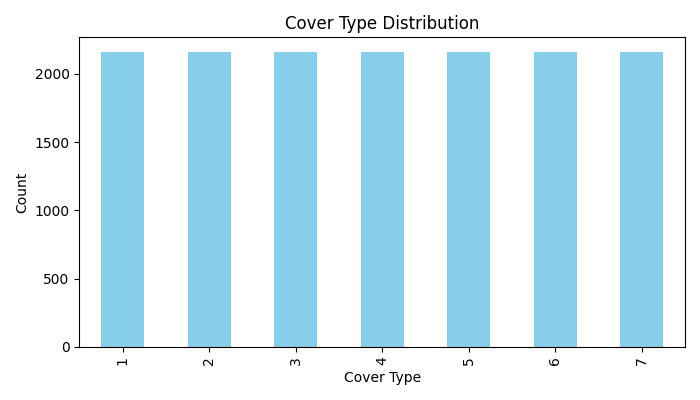
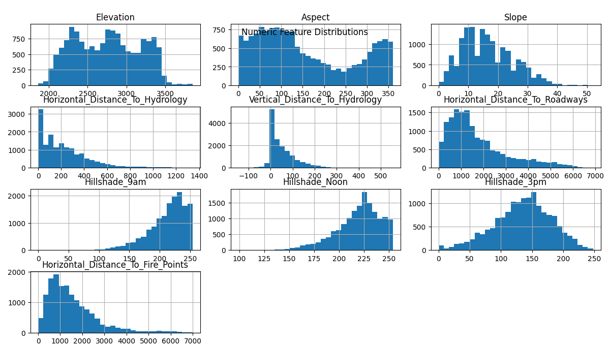
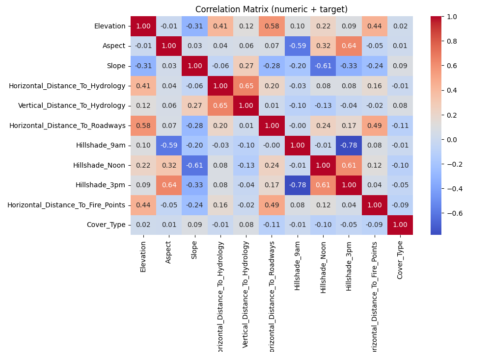
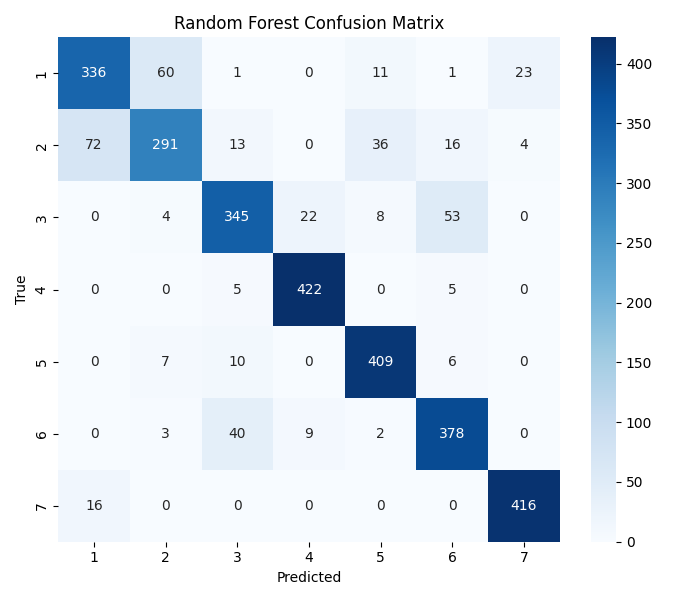
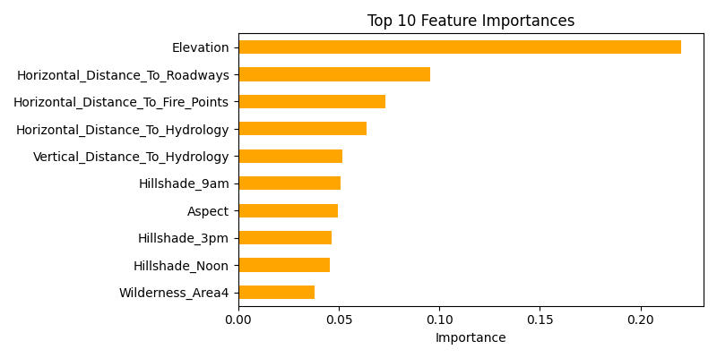
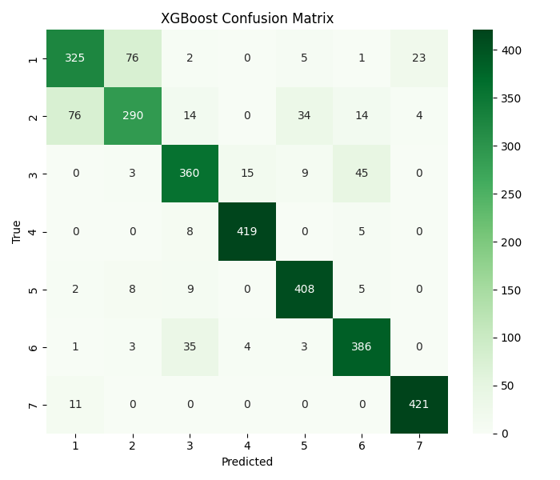
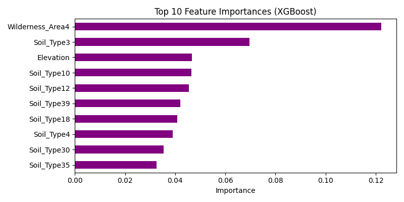

# 🌲 Forest Cover Type Prediction

## 📌 Project Overview
This project develops a **machine learning model to predict forest cover types** for a given **30m × 30m patch of land** using cartographic and environmental variables.

The dataset originates from the **Roosevelt National Forest in northern Colorado** and contains terrain, soil, and hydrological features collected by the **U.S. Forest Service**.

The goal is to classify each land patch into one of **seven forest cover categories** based on environmental characteristics.

---

# 🎯 Objective
Develop a machine learning system capable of predicting the **forest cover type** using terrain, soil type, wilderness area, and hydrological distance features.

---

# 🌳 Forest Cover Classes

| Class | Forest Type |
|------|-------------|
| 1 | Spruce/Fir |
| 2 | Lodgepole Pine |
| 3 | Ponderosa Pine |
| 4 | Cottonwood/Willow |
| 5 | Aspen |
| 6 | Douglas-fir |
| 7 | Krummholz |

---

# 📊 Dataset Description

The dataset contains cartographic variables describing forest terrain.

Important features include:

- Elevation  
- Aspect  
- Slope  
- Horizontal Distance to Hydrology  
- Vertical Distance to Hydrology  
- Horizontal Distance to Roadways  
- Hillshade (9am, Noon, 3pm)  
- Horizontal Distance to Fire Points  
- Wilderness Area indicators  
- Soil Type indicators  

Target variable:
Cover_Type

---

# 🔎 Exploratory Data Analysis

Below are some key visualizations from the dataset.

### Feature Distribution


### Feature Relationship Analysis


### Terrain Feature Analysis


### Hydrology Distance Analysis


### Hillshade Distribution


### Feature Importance Visualization


### Additional Dataset Insights


---

# 🧠 Machine Learning Workflow

The project follows a structured ML pipeline:

1. Data Loading  
2. Exploratory Data Analysis  
3. Data Preprocessing  
4. Feature Engineering  
5. Baseline Model Training  
6. Hyperparameter Tuning  
7. XGBoost Model Training  
8. Model Evaluation  

---

# 🤖 Best Model

The best performing model is an **XGBoost Classifier**.

Saved model file:
artifacts/xgb_best_model.joblib

---

# 📂 Project Structure
forest-cover-type-prediction
│
├── artifacts
│ └── xgb_best_model.joblib
│
├── src
│ ├── eda_load.py
│ ├── eda_analysis.py
│ ├── preprocess_split.py
│ ├── model_baseline.py
│ ├── model_tuning.py
│ ├── model_xgboost.py
│ ├── predict_sample.py
│ └── app.py
│
├── images
│ ├── P4F1.png
│ ├── P4F2.png
│ ├── P4F3.png
│ ├── P4F4.png
│ ├── P4F5.png
│ ├── P4F6.png
│ └── P4F7.png
│
├── requirements.txt
├── .gitignore
└── README.md

---

# ⚙️ Installation

Clone the repository:

```bash
git clone https://github.com/shrashtimittal/forest-cover-type-prediction.git
cd forest-cover-type-prediction
Install dependencies:
pip install -r requirements.txt
---

# ▶️ Running the Project

Train the model:

```bash
python src/model_xgboost.py
Run predictions:
python src/predict_sample.py
Run the application:
python src/app.py
---

## 🚀 Future Improvements

- Deploy the model using **Streamlit**
- Improve feature engineering
- Apply **deep learning models**
- Add model explainability using **SHAP values**

---

## 👩‍💻 Author

**Shrashti Mittal**

AI • Machine Learning • Aerospace Systems • Quantum Computing
